# Apple Push Notification Service

애플에서 제공하는 Push notification 서비스로, 애플 개발자 페이지에서 Key, 인증서를 설정해야 사용가능하다.

## APNs인증서 설정

푸시를 사용하기 위한 앱에 대한 설정이다.

1. [Apple 개발자](https://developer.apple.com/account) → Certificates → + 버튼 선택
    
    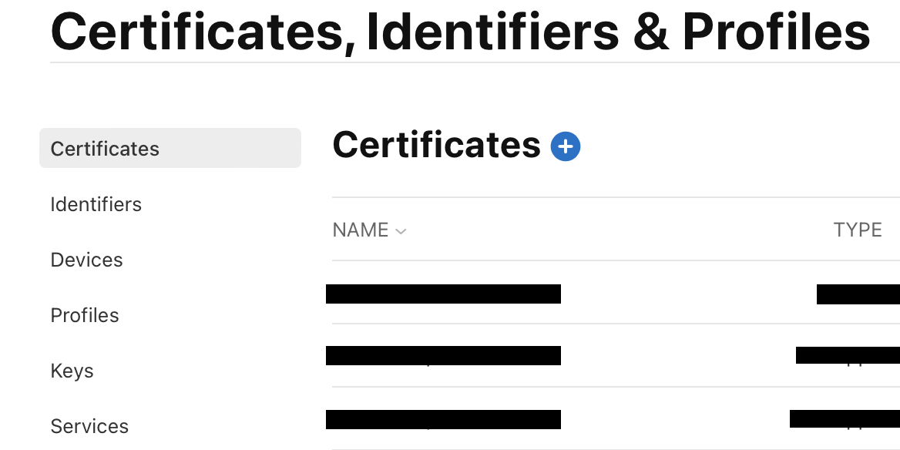
    
2. 인증서 종류 선택
    - SandBox는 개발용 SSL이다. 두 개를 한 방에 커버할 수 있는 SandBox & Production 항목을 선택한다.
    
    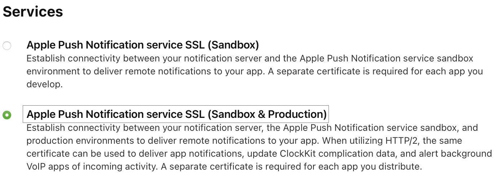
    
3. Push 서비스를 지원할 App ID 선택
    
    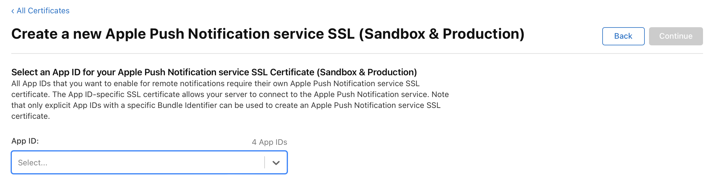
    
4. CSR(Certificate Signing Request) 파일 업로드 → Continue
    
    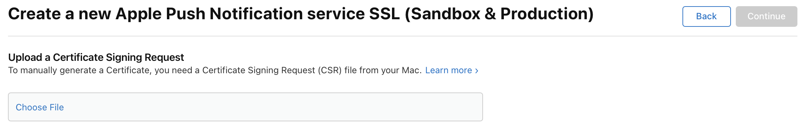
    
    - 개발자의 맥에서 CSR파일을 만들어서 업로드 해야한다.
        1. 키체인 접근 → 인증서 지원 → 인증 기관에서 인증서 요청 선택
            
            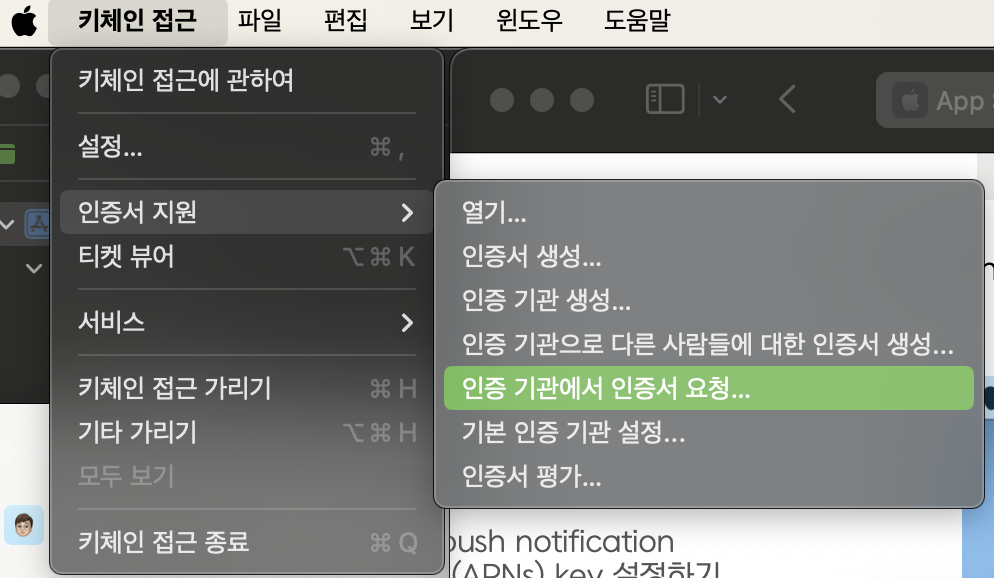
            
        2. 디스크에 저장됨 선택 → 계속 → 저장
            
            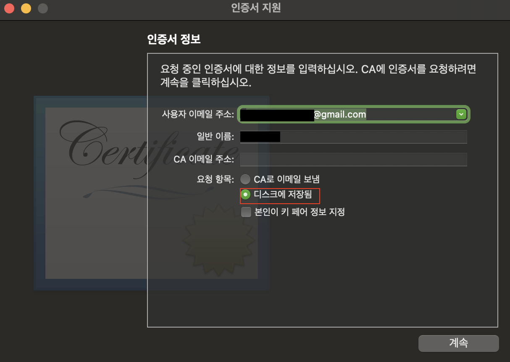
            
5. 인증서 다운로드 → 인증서 실행시켜 키체인에 추가
    
    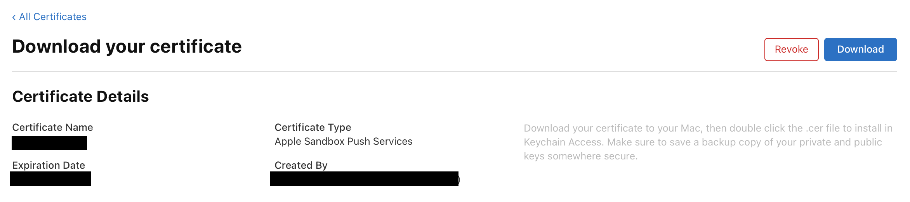
    
    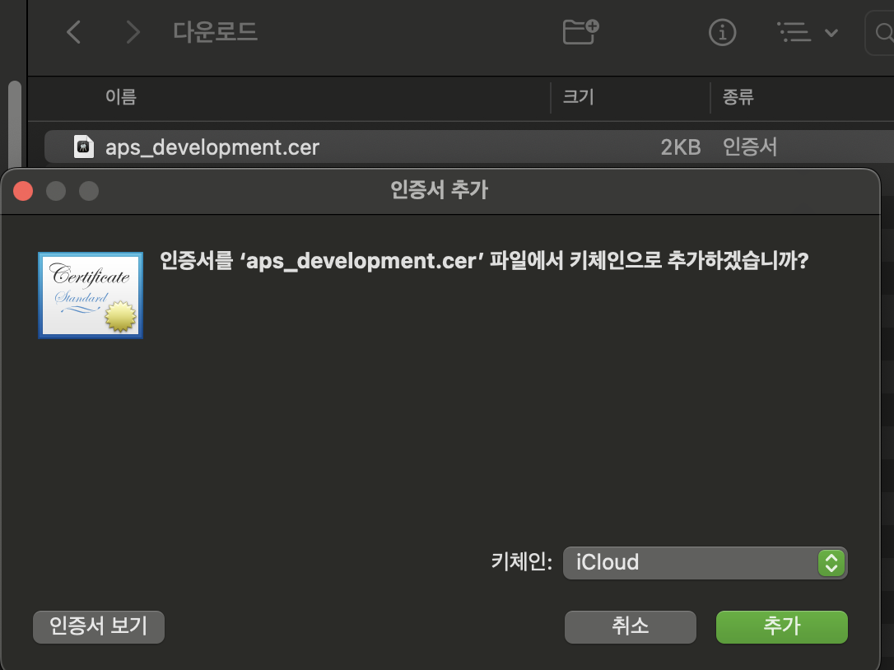
    

## APNs Key 설정

푸시 서버측에서 사용할 APNs Key를 발급하는 과정이다.

1. Keys → + 버튼 선택
    
    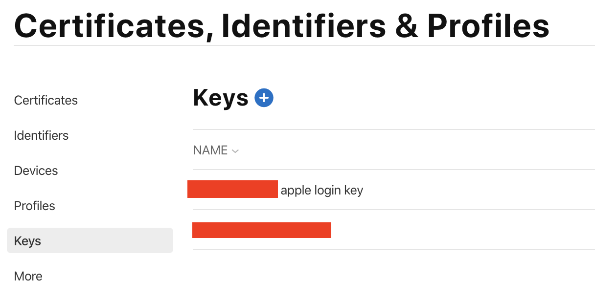
    
2. APNs 항목 선택
    
    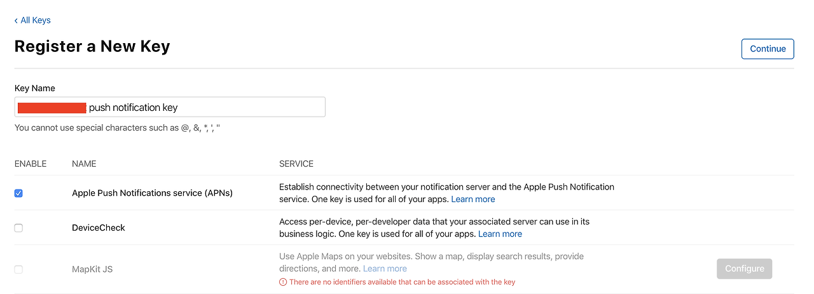
    
3. Key 파일 다운로드. **1회만 다운로드 가능하니 잘 보관!**
    
    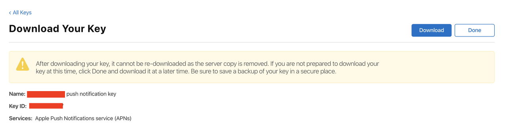
