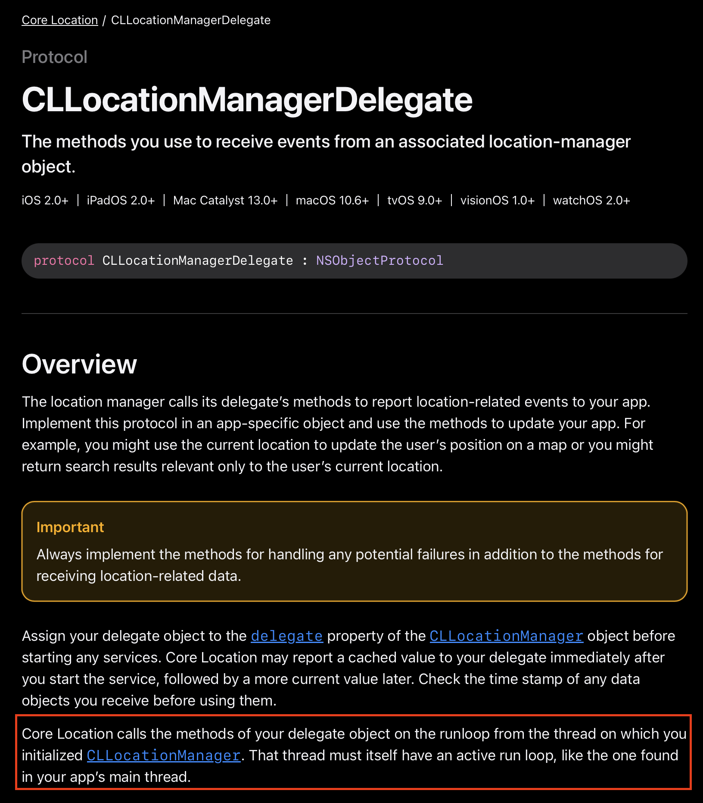

# CLLocationManagerDelegate와 RunLoop

## 위치 서비스를 이용하기 위한 CLLocationManager 사용

```swift
init() {
    super.init()
    let locationManager = CLLocationManager()
    locationManager.delegate = self
    locationManager.desiredAccuracy = kCLLocationAccuracyBest
}
```

- CLLocationManager를 초기화 하고 delegate를 설정함

```swift
extension LocationService: CLLocationManagerDelegate {
    func locationManager(
        _ manager: CLLocationManager,
        didUpdateLocations locations: [CLLocation]
    ) {
        print("위치 정보 업데이트")
    }
    
    func locationManager(
        _ manager: CLLocationManager,
        didFailWithError error: Error
    ) {
        print(error)
    }
}
```

- 위치를 가져올 객체가 `CLLocationManagerDelegate`를 준수하도록 하면 콜백 함수가 호출된다.

### ⚠️ 위치 정보를 못가져 오는 상황이 발생

- `CLLocationManagerDelegate`의 콜백 함수들이 호출되지 않아 위치 정보를 가져오지 못하는 경우가 있음

## CLLocationManagerDelegate 공식 문서



<aside>
💡

Core Location은 `CLLocationManager`를 초기화한 스레드의 런루프에 있는 delegate 객체의 메서드를 호출합니다. 해당 스레드 자체에는 앱의 메인 스레드에 있는 것과 같은 활성 런루프가 있어야 합니다.

</aside>

- `CLLocationManager`는 내부적으로 Run loop 기반으로 delegate 함수 호출을 처리함.
- delegate 함수는 `CLLocationManager`를 생성한 스레드의 Run loop에서 호출됨
- 즉, Run loop가 없는 스레드에서는 delegate가 호출되지 않음.

### ❌ 안되는 예

```swift
DispatchQueue.global().async {
    let locationManager = CLLocationManager()
    locationManager.delegate = self
    locationManager.requestWhenInUseAuthorization()
    locationManager.startUpdatingLocation()
}
```

- Run loop가 없는 글로벌 큐에서 실행하면 위치 업데이트 안 됨.

## ✅ 올바른 사용법

### 1. 메인 스레드에서 생성

```swift
class LocationService: NSObject, CLLocationManagerDelegate {
    private let locationManager = CLLocationManager()

    override init() {
        super.init()
        locationManager.delegate = self
        locationManager.requestWhenInUseAuthorization()
        locationManager.startUpdatingLocation()
    }

    func locationManager(
        _ manager: CLLocationManager,
        didUpdateLocations locations: [CLLocation]
    ) {
        print("Got location: \(locations)")
    }
}
```

- 메인 스레드는 기본적으로 Run loop가 존재하기 때문에 위 코드가 정상 동작함

### 2. 수동으로 Run loop 실행

```swift
class BackgroundLocationThread: Thread, CLLocationManagerDelegate {
    var locationManager: CLLocationManager?

    override func main() {
        locationManager = CLLocationManager()
        locationManager?.delegate = self
        locationManager?.requestWhenInUseAuthorization()
        locationManager?.startUpdatingLocation()

        RunLoop.current.run() // 🔥 런루프 실행
    }

    func locationManager(
        _ manager: CLLocationManager,
        didUpdateLocations locations: [CLLocation]
    ) {
        print("Background thread location: \(locations)")
    }
}
```

- `RunLoop`를 수동으로 실행하여 위치 정보 업데이트도 가능함
