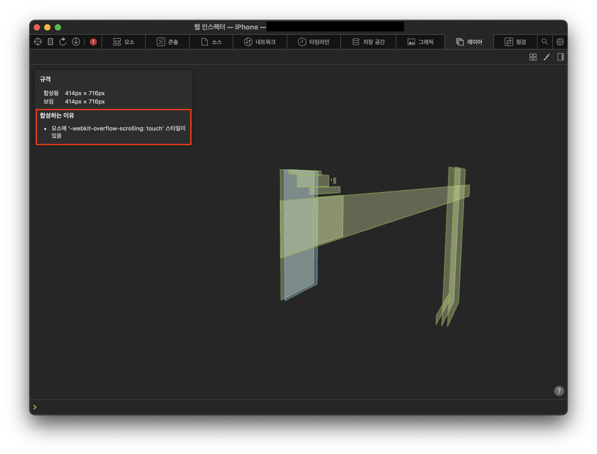

# SwiftUI+WKWebView

# Pull To Refresh 적용

- WKWebView에 Refresh Control 추가해서 리프레시 기능 추가 가능

### 예시

```swift
import SwiftUI
import WebKit

struct WebView: UIViewRepresentable {
    let url: String

    func makeUIView(context: Context) -> WKWebView {
        let webview = WKWebView(frame: .zero)
        let refreshControl = UIRefreshControl()
        refreshControl.addTarget(webview, action: #selector(WKWebView.webViewPullToRefreshHandler(source:)), for: .valueChanged)
        webview.scrollView.refreshControl = refreshControl
        webview.scrollView.bounces = true
        return webview
    }
    
    func makeCoordinator() -> Coordinator {
        return Coordinator(parent: self)
    }

    func updateUIView(_ uiView: WKWebView, context: Context) {
        uiView.navigationDelegate = context.coordinator
        uiView.load(URLRequest(url: URL(string: self.url)!))
    }
    
    
    class Coordinator: NSObject, WKNavigationDelegate {
        let parent: WebView
        
        init(parent: WebView) {
            self.parent = parent
        }
    }
}

extension WKWebView {
    @objc func webViewPullToRefreshHandler(source: UIRefreshControl) {
        DispatchQueue.main.asyncAfter(deadline: .now() + 0.7) {
            self.reload()
            source.endRefreshing()
        }
    }
}
```

- `webview.scrollView.bounces`는 기본값이 `true`이기 때문에 설정해주지 않아도 무방함.

### 💥Trouble Shooting

- Refresh 동작하지 않는 문제
    
    ### 증상
    
    - PTR 기능이 동작 안됨.
    - ScrollView 이벤트 자체가 전달이 안되는 것을 확인함.
    
    ### 원인
    
    
    
    - CSS 설정 문제
        
        ```css
        -webkit-overflow-scrolling: touch
        ```
        
        - CSS에서 스크롤 동작을 부드럽게 하는 속성이라고 함.
        - 해당 속성이 추가되어 있으면 `WKWebView.scrollView`의 스크롤 이벤트가 제대로 동작하지 않는 것으로 예상됨.
        - 참고로 해당 속성은 iOS 13 이후로 불필요함.
        - [https://developer.mozilla.org/en-US/docs/Web/CSS/-webkit-overflow-scrolling](https://developer.mozilla.org/en-US/docs/Web/CSS/-webkit-overflow-scrolling)
    
    ### 해결
    
    - CSS 속성(`-webkit-overflow-scrolling`) 제거
