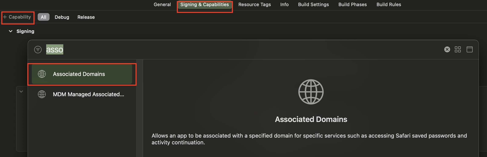
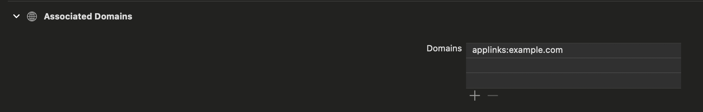

# Univeral Link

## Deep Link

딥링크는 특정 주소 혹은 값을 입력하면 앱이 실행되거나 앱 내 특정 화면으로 이동시키는 기능을 수행한다. 딥 링크는 방식에 따라 크게 2가지로 나뉜다.

1. URL Scheme 방식
    - ex) Scheme://Path, twitter://signup
2. 도메인 주소를 이용한 방식
    - ex) https://xxx.com/signup

앱이 설치된 경우의 동작만 보장한다.

### URI Scheme 방식의 한계

앱의 숫자가 많아지면서 Scheme의 중복이 일어나는 경우가 많아졌다. 중복이 일어나는 경우 바로 앱으로 이동하는게 아니라 어떤 앱으로 이동할지 선택하는 동작이 추가되므로 편하지 않다.

한계를 극복하기 위해 고유값이 되는 도메인 주소를 사용하는 방법이 등장한다.

iOS에서는 Universal Link로 불린다.

## 구현

1. Signing & Capabilities → +Capability → Associated Domains에 도메인 추가
    
    
    
    
    
    - Universal Link를 허용할 도메인을 입력하는 과정.
    - `applinks:example.com`
        - [example.com](http://example.com) 도메인으로 이동시 앱이 열리는 것이다.(메모장, 사파리 등등)
2. AASA 파일 세팅
    - 서버에 apple-app-site-association 라는 이름의 파일에 아래의 json 형식으로 필요한 사항을 추가해야 함.
        - .well-known 디렉터리에 넣으면 됨.
        - 확장자는 없음.
    
    ```json
    {
      "applinks": {
          "details": [
               {
                 "appIDs": [ "ABCDE12345.com.example.app", "ABCDE12345.com.example.app2" ],
                 "components": [
                   {
                      "#": "no_universal_links",
                      "exclude": true,
                      "comment": "Matches any URL with a fragment that equals no_universal_links and instructs the system not to open it as a universal link."
                   },
                   {
                      "/": "/buy/*",
                      "comment": "Matches any URL with a path that starts with /buy/."
                   },
                   {
                      "/": "/help/website/*",
                      "exclude": true,
                      "comment": "Matches any URL with a path that starts with /help/website/ and instructs the system not to open it as a universal link."
                   },
                   {
                      "/": "/help/*",
                      "?": { "articleNumber": "????" },
                      "comment": "Matches any URL with a path that starts with /help/ and that has a query item with name 'articleNumber' and a value of exactly four characters."
                   }
                 ]
               }
           ]
       },
       "webcredentials": {
          "apps": [ "ABCDE12345.com.example.app" ]
       },
    
        "appclips": {
            "apps": ["ABCED12345.com.example.MyApp.Clip"]
        }
    }
    ```
    
    - AppID는 해당 앱의 TeamID(ABCDE12345) + “.” + BundleID(com.example.app)이다.
    - 각 components들의 detail에 대한 공식 문서
        - [https://developer.apple.com/documentation/bundleresources/applinks](https://developer.apple.com/documentation/bundleresources/applinks)

## Deferred Deep Link

Deep link는 앱이 설치된 상황에서의 동작만을 보장하는 한계가 있다. 앱이 설치되지 않은 경우에 대한 보완으로 사용할 수 있다.

### 앱이 설치되지 않은 환경에서 동작

1. 링크 선택 or 도메인 방문(해당 페이지에 대한 정보를 앱에서 띄우려고 시도함.)
2. 앱이 설치되어 있지 않으므로 앱 스토어로 이동
3. 앱을 설치
4. 설치 후 앱을 실행하면 바로 딥링크 동작

동작의 특성상 앱이 설치되고 실행될 때 까지, 딥링크 정보를 가지고 있을 서버가 필요하다.

서버를 직접 구현하거나, 솔루션을 구매해서 구현할 수 있다.
